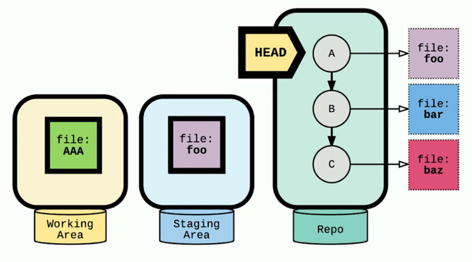
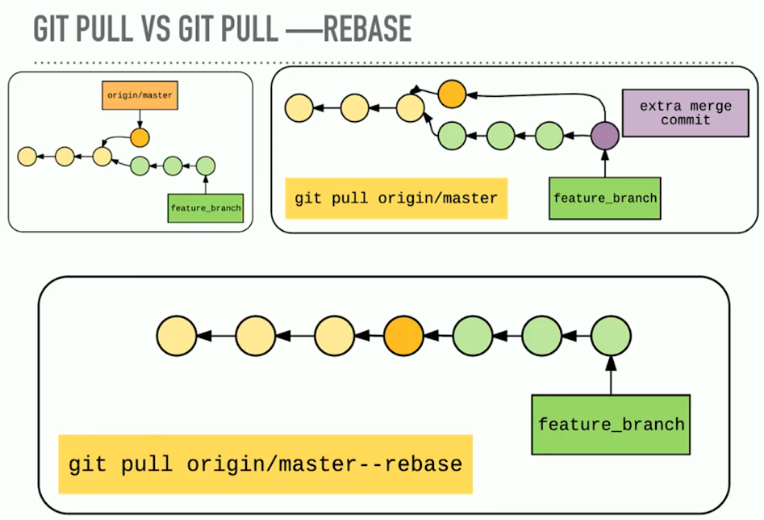

# Frontend Master Git In-depth

## Git Best Practice

**Commit often, perfect later, publish once**.

When working locally:
- Commit whenever you make changes.

Before pushing work to a shared repo:
- Rebase to clean up the commit history.

## How Git Store Information?

At its core, git is kind of like a key value store. The value is the data, and
the key is hash of the data. We can then use the key to retrieve the content.

The key is called the SHA1, which is a cryptographic has function and this
value should always be the same if we given input is the same. This type of
system also called content addressable storage system and that's because we
can use the content to generate the key. So if the hash is always the same
given a piece of content that also means, that given the content, we can
generate the key.

## Git Blobs

The way that git stores things is in git objects, and the very basic one is
called a blob. So, git stores the compressed data in blob, along with some
metadata about that blob in the header:
- The identifier *blob*.
- The size of the content.
- \0 delimiter (null string terminator in C).
- Content.

The way that git does this under the hood is with a command `git hash-object`,
here's an example:
```sh
echo 'hello world' | git hash-object --stdin
```

**If we run the hash method on the same content multiple times, we'll always
get the same result**. Because of this, blob are generally unique in git. The
likely hood of two pieces of content generate the same SHA are infinitely
small.

### Where Git Stores Its Data?

The usual git working repository stores its data in `.git` directory (there's
also git bare repository which is different from usual git).

### Where Are The Blobs Stored?

Our blobs are stored in `.git/objects` directory. The directory start with the
first two characters of the hash, and then the file is the rest of the
character. Here's an example of blobs path:
```sh
# for hash `3b18e512dba79e4c8300dd08aeb37f8e728b8dad`, the path would be like
# this.
.git/objects/3b/18e512dba79e4c8300dd08aeb37f8e728b8dad
```

But, the blobs is missing some information:
- Filenames.
- Directory structure.

If we save a file as blob, how do we know what that file was called and what
directory it was stored in? Git stores this information in something called
`tree`.

The tree contains pointers (using SHA1):
- To blobs
- To other trees.

> Why the tree contains pointers to other trees? Because subdirectories can be
> nested.

The tree also has some metadata, which stores:
- Type of pointers (*blob* or *tree*).
- Filename or directory name of the that it's pointing to.
- Mode (executable, symbolic link, things that is important when we're pulling
the repo).

**In git, identical content is only stored once**. Below is the illustration:


## Git Optimization

Git has other optimization too, which is related to they way we work. So, as
our file change, they stay mostly similar, like we might add a method or
function here and there.

The way git deals with changes, git is going to optimize for files staying
mostly similar by compressing these files together into a *Packfile*. The
*Packfile* stores the object and it stores something called a *delta*, and
that delta is the difference between one version of the file and the next.

Generally packfiles are generated when we have too many objects during garbage
collection, or when we push to a remote repository.

> Git runs garbage collection under the hood, generally every few weeks or
> unless we ask git to.

## Git Commits

Commits are just like the other types of git objects.

A commit points to a tree and contains these metadata:
- Author and committer.
- Date.
- Message.
- Parent commit (one or more in case of merge).

And the SHA1 of the commit is the hash of all this information.

Git commits points to parent commits and trees. Here's the illustration:


The first or initial commit doesn't have a parent, so other than the first
commit, git commits points to the parent commits which is usually the previous
commit (there might be some difference with merge case).

**The tree is a "snapshot of the repository"**. Basically, the tree is what the
repository staging area looked like at the time of the commit, which point to
the files and directories.

So, **a commit is a combination of the changes from the staging area on the
previous commit**.

> If we change any data about the commit, the commit will have a new SHA1 hash.
> Even if the files didn't change, at least the created date will.

## Read Git Objects

We can read the git objects using this command:
```sh
git cat-file -p <git-hash>
```
or we can check the type of the objects with this command:
```sh
git cat-file -t <git-hash>
```

## Working Area, Staging Area, and Repository

### Working Area (A.K.A Working Tree)

The working area is sometimes also called the working tree. The working area is
basically the files that are not in the staging area and not handled by git
(which also called untracked file).

The working area is like our scratch space, it's a place where we can add new
content, modify the existing files, or delete a file. If the file we modify or
delete is in our repository, we don't have to worry about losing our work.

### Staging Area (A.K.A Index, Cache)

The staging area is sometimes also called the cache or the index. The staging
area is how git knows what will change between the current commit and the next
commit.

A clean staging area isn't empty, what's going on is the baseline staging area
is a copy of our latest commit. So, it contains a list of files that were in
our last commit as well as the SHA1 hash of those files as they were in their
last commit.

When we add, remove, or rename files to the staging area git knows because the
SHA1 of the changed file is now different from the SHA1 of the file that was
in the repository.

In order to look at our index, we can use this command:
```sh
# `-s` flag is to show mode bits, object name, and stage number.
git ls-files -s
```
basically `git ls-files` is a command to show all the files in the current
working tree.

#### Git add -p

`git add -p` allows us to stage our changes in chunk, so we can choose which
changes that we want to put in the same commit and didn't put every changes in
the commit.

We can use `git add -p` with the tracked files, we can't use these command with
untracked files because git doesn't know what changed in the file.

#### Unstage Files From Staging Area

When we unstage files from the staging area, we're not removing the files. The
staging area isn't empty. What we're doing is replacing the files with a copy
that's currently in the repository.

### Repository

The repository is all the files that git knows. The repository contains all of
our commits, which contains a snapshot of our working and staging area.

### Basic Content Movement in Git


## Stashing

There's one more place where git stores files, that's through `git stash`. The
git stash is a way to save uncommitted work. The stash is save from most
disruptive git operations.

To stash the changes of tracked files, we can use this command:
```sh
git stash
```

To stash the changes of tracked and untracked files, we can use this command:
```sh
git stash -u
```

To see all the available stash, we can use this command:
```sh
# `git stash list` take arguments similar to `git log`. so, we can use something
# like this `git stash list --oneline`.
git stash list
```

To see the content of the stash, we can use this command:
```sh
# `git stash show` take arguments similar to `git diff`. so, we can use
# something like this `git stash show stash@\{0\} -p`.
git stash show stash@\{0\}
```

To apply the content of the stash to current working tree, we can use this
command:
```sh
git stash apply
```
we can also specify the stash like this:
```sh
git stash apply stash@\{0\}
```

We can also name the stash with this command:
```sh
git stash save '<name-stash>'
```

We can start a new branch from stash with this command:
```sh
git stash branch <optional-branch-name>
```

We can apply and remove the stash from the stash list with this command:
```sh
git stash pop <optional-stash-name>
```
if there's a conflict, those command won't remove the stash from the stash
list. We need to solve the conflict and remove the stash manually.

We can remove the stash with this command:
```sh
# remove the last stash.
git stash drop

# remove the n-th stash.
git stash drop stash@\{n\}
```
or we can remove all the stash with this command:
```sh
git stash clear
```

## Git References

References are pointers to commits. There are three types of git references:
- Tags and annotated tags.
- Branches.
- HEAD.

### What is a Git Branch?

A branch is just a pointer to a particular commit. The pointer of the current
branch changes as new commits are made.

### What is a Git HEAD?

A HEAD is how git knows what branch we're currently on, but most importantly,
HEAD is how git knows what the parent of the next commit will be.

HEAD usually points to the name of the current branch, but HEAD can also point
to a commit (called detached HEAD state).

HEAD move when we make a new commit in the current branch or when we checkout
a branch or commit.

### Tags

Tags are just a simple pointer to a commit. When we create a tag
with no arguments, it captures the value in HEAD.

We can create tags with this command:
```sh
git tag <tag-name>
```

#### Annotated Tags

Annotated tags point to a commit but store additional information (author,
message, date).

We can create annotated tags with this command:
```sh
git tag -a <tag-name> -m '<optional-tag-message>'
```

#### Working With Tags

List all tags in a repo:
```sh
git tag
```

List all tags in repo and what commit they're pointing to:
```sh
git show-ref --tags
```

List all the tags pointing at a commit:
```sh
git tag --points-at <commit>
```

Looking at the tag content:
```sh
git show <tag-name>
```

#### Tags Vs Branches

Tags: The commit that a tag points doesn't change, it's a snapshot.
Branches: The commit that a branch points change every new commit to the
repository.

### HEAD-less/Detached HEAD

We'll enter a detached HEAD state when we checkout a specific commit or a tag
instead of a branch. Git move the pointer to the commit or tag that we
specified.

If we make a new commit in a detached HEAD state, there's no references to
the new commit. Git doesn't know how to point to the new commit. So, we don't
do anything with the new commit that we've made in a detached HEAD state, we
can consider the commits lost.

#### Save New Commit in Detached HEAD

What do we do if we want to save our work in detached HEAD state? There's a few
things we can do:
- We can create a new branch that points to the last commit we made in detached
HEAD state. Now that commit has a permanent reference of the new branch name.

> Why only the last commit? The very last commit has reference to all of its
> parents. So as long as we have the last commit, we also got the other commits
> too.

### Check What References Pointing To

We can check what our references pointing to with this command:
```sh
git show-ref --heads
```

## Git Merge

Merge commits are commits that happen to have more than one parent. Merge
commit maintains all those same commits that we had created on a feature
branch, and **the merge commit is just a marker when a new feature was merged
into another branch**.

### Fast Forward

Fast forward happens when there's a clear path from the tip of the current
branch commit to the tip of the target branch commit.

To retain the history of a merge commit, even if there are no changes to the
base branch, we can use this command:
```sh
git merge --no-ff
```
that command will force a merge commit even when merge commit isn't necessary.

### Merge Conflict

Merge conflict happen when we try to merge but our files have diverged, the
changes are not compatible. Git will stop until the conflict are resolved.

#### Git Rerere

Rerere stands for Reuse recorded resolution. So, basically git rerere record
how we resolved a merge conflict and we can use that on future merge conflict.

This git rerere can be useful for long lived branch (like a refactor) and
rebasing.

Before we can use git rerere, we need to turn it on using this command:
```sh
# for specific repository.
git config rerere.enabled true

# for every repository.
git config --global rerere.enabled true
```
we can use this command to check what's going on with git rerere:
```sh
git rerere diff
```
basically the command above show us how the conflict were resolved.

## Git Log

To examine git commit history, we can use git log. We can also log
the files that have been moved or renamed using `--name-status` and `--follow`
flags
like this:
```sh
# to make it brief, add `--oneline` flag.
git log --name-status --follow <filename>
```

We can also selectively include or exclude file using `--diff-filter` flag like
this:
```sh
# this example is to filter a commit that has a file with status `added`.
git log --name-status --diff-filter=A
```

## Referencing Commits

There are two symbols we can use to referencing commits, using `^` or `~`.

### Using `^` For Referencing Commit

`^` or `^n`:
- No arguments (which is equal to `^1`): the first parent commit.
- `n`: the `n`th parent commit.

### Using `~` For Referencing Commit

`~` or `~n`:
- No arguments (which is equal to `~1`): the first commit back, but only
following the first parent commit.
- `n`: the number of commits back, following only the first parent commit.

> The `^` and `~` can be combined.

### Example of Referencing Commit

Below is the example of referencing commit with `^` and `~`:


## Git Show

Git show let us look at commits an their contents.

We can show commit and content using this command:
```sh
git show <commit>
```

We can show changes files in commit:
```sh
git show <commit> --stat
```

We can look at a file from another commit:
```sh
git show <commit>:<file>
```

## Git Diff

Git diff shows us changes:
- between commits.
- between staging area and repository.
- in working area.

For unstaged changes, we can use this command:
```sh
git diff
```

For staged changes, we can use this command:
```sh
git diff --staged
```

To show which git branch are merged with master branch and can be clean up, we
can use this command:
```sh
git branch --merged master
```

To show which git branch that haven't merged with master branch, we can use
this command:
```sh
git branch --no-merged master
```

## Git Checkout

Git checkout allow us to restore working tree files or switch branches.

Git checkout can move the HEAD pointer and update the staging area and the
working directory. If we're checking out a file, it can perform the same
actions without moving the pointer.

### Git Checkout Branch

This is what happens when we git checkout a branch:
1. Change HEAD to point to the new branch.
2. Copy the commit snapshot to the staging area.
3. Update the working area with the branch contents.

> Any changes the working area are kept. Changes in the staging area are also
> kept unless they're conflict with any changes in a branch you're about to
> checkout.

### Git Checkout File

What happens when we git checkout a file? It will replace the working area file
with the version of the current staging area from the last commit.

**This operation will overwrites the file in the working directory without
warning**.

### Git Checkout Commit

What happens when we git checkout <commit> -- file? It will update the staging
area to match the commit and update the working area to match the staging area.

**This operation will overwrites the file in the staging area and working
directory without warning**.

### Restore Deleted File With Git Checkout

We can restore the deleted file from a commit where we deleted the file like
this:
```sh
git checkout <commit-where-we-delete-the-file>^ -- <file_path>
```

## Git Clean

Git clean will clear our working area by deleting untracked files. **This
operation can't be undone**. But, we can use `--dry-run` flag to see what would
be deleted. We can also use `-d` flag to clean up both files and directories.
We can use `-f` flag to actually do the deletion. Below is an example of git
clean command:
```sh
git clean --dry-run

git clean -d -f
```

## Git Reset

Git reset is another command that performs different actions depending on the
arguments, with a path or without a path.

By default, git performs `git reset --mixed`.

A big difference between git reset and git checkout is that git checkout will
move the HEAD but the branch reference stays where it was, meanwhile git reset
move the HEAD and move the branch reference which means our branch is now
modified.

For commits, git reset move the HEAD pointer and optionally modify files. But
if we pass the file path, it's not going to move the HEAD pointer, it's just
going to modify the files.

**Git reset can change git commit history**.

### `--soft` Flag

What `git reset --soft` does is move the HEAD pointer, for example:
```sh
git reset --soft HEAD~
```
what those command do is move the HEAD pointer to previous commit. Below is the
illustration for the command above:


> The commit `a` from illustration above will be lost if we make a new commit.

### `--mixed` Flag

What `git reset --mixed` or `git reset` (without any flags) does is move the
HEAD pointer and then copy the file from the commit that HEAD is pointing to
into the staging area. For example:
```sh
# both of these command is the same.
git reset --mixed HEAD~
git reset HEAD~
```
what those command do is move the HEAD pointer to previous commit and then move
the file from the commit that HEAD is pointing to into the staging area. Below
is the illustration for the command above:


### `--hard` Flag

What `git reset --hard` does is move the HEAD pointer, copy the file from the
commit that HEAD is pointing to into the staging area, and also copy the same
file to the working area.

**This operation overwrites files and cannot be undone**.

Here's an example:
```sh
git reset --hard HEAD~
```
below is the illustration for the command above:


### Giving a Filename Argument

When we give a filename or file path like this:
```sh
git reset <file>
```
what it does is copy the file from the commit HEAD is pointing to but didn't
move the HEAD pointer. Below is the illustration for the command above:


### Giving a Commit Argument

If we give a commit into git reset command like this:
```sh
git reset <commit> -- <file>
```
what it does is copy the file from those specific commit into the staging area
but didn't move the HEAD pointer. Below is the illustration for the command
above:


**We can't specify git reset commit in a file with any flags, only works with
`--mixed` flag**.

### Undo Git Reset

Git had a reference called `ORIG_HEAD` which means original HEAD, when we do
an operation like git reset or git merge, git save where HEAD before those
operation. With that in mind, we can go back to previous state of HEAD with
this command:
```sh
git reset ORIG_HEAD
```

## Git Revert

Git revert is basically a safe reset. Git revert is going to create a new
commit that introduces the opposite changes from the specified commit, the
original commit stays in the repository.

> Git revert does not change git commit history.

## Git Amend

Git amend is a quick and easy shortcut that let us make changes to the last
commit. We can amend a commit with this command:
```sh
git commit --amend
```

## Git Rebase

What is rebase anyway? Imagine our feature branch and master branch have
diverged and we don't want a messy merge commit in our history.

So, instead of having our commits be mixed between commits from master, we can
apply all of our commits cleanly on top of the master branch. And we can do
that by changing the parent commit of our commits.

**Basically rebase means give a commit a new parent commit**.

### How Rebase Works

Let's say we want to put the master branch commit into the feature branch, we
can use this command:
```sh
# assuming we're currently in feature branch.
git rebase master
```

So, the first thing that rebase does is rewind HEAD back to master branch and
then copied all of our commit in feature branch on top of the last commit from
master branch. And finally, move the HEAD back to the last newly copied commit
in feature branch. Below is a simplified illustration the result of git rebase:


### Interactive Rebase

With interactive rebase, commits can be edited, removed, combined, re-ordered,
and inserted before the commits replayed on top of the new HEAD.

We can trigger interactive rebase with `-i` flag. Interactive rebase opens
and `$EDITOR` with a list of todos in the format of:
```sh
<command> <commit> <commit-message>
```

We can use interactive rebase like this:
```sh
git rebase -i <commit-to-fix>^
```

### Use Rebase To Split Commit

Editing a commit can also split it up into multiple commits. The general
step is like this:
1. Start an interactive rebase with `git rebase -i <commit-to-split>^`.
2. Mark the commit with an `edit`.
3. `git reset HEAD^`.
4. `git add` and `git commit` until the working area clean.
5. `git rebase --continue`.

### Fixup and Autosquash

We can put changes to specific commit with:
```sh
# we can use the SHA1 hash or the commit message
git commit --fixup <SHA>
```
and then we use rebase to put the change into the `<SHA>` like this:
```sh
# `--autosquash` means to put any commits with `fixup` or `squash`
# automatically into the right <SHA>.
git rebase -i --autosquash <SHA>^
```

The commit marker for `fixup` and `suqash` commit is `fixup! <SHA>` and
`squash! <SHA>`. For more info, we can check `man git-commit`.

### `--exec` Flag

We can specify a command to run after every rebase action. So as it's replaying
commits, we can say "git, run this command after every commit".

### Cancel Rebase

We cancel the rebase process with this command:
```sh
git rebase --abort
```

> Tips: make a new copy of our branch every time we want to rebase current
> branch with this command `git branch my-branch-backup`. If rebase "succeeds"
> but we messed up, we can reset using this command
> `git reset my-branch-backup --hard`.

## Merge Vs Rebase

Below is the illustration of the difference between merge and rebase:


## Git Pull Vs Git Pull Rebase

Below is the illustration between `git pull` and `git pull --rebase`:


## Git Reflog

By default git keeps commits around for about 2 weeks. If we need to go back
in time and find a commit that's no longer referenced, we can use this command:
```sh
git reflog
```

The syntax for reflog is different. Here's an example:
```sh
HEAD@{2}
```
which means the value of HEAD as it was 2 moves ago.

## References

- [Course's github repo](https://github.com/nnja/advanced-git).
